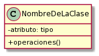
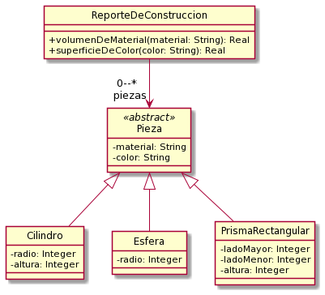
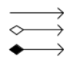
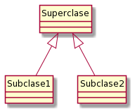
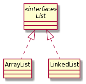

# Diagramas de clases UML (resumen)
El objetivo de este documento es mostrar un breve resumen de los principales elementos de un diagrama de clases, para conocer su sintaxis. 

- [Clases](#clases)
    - [Nombre de la clase](#nombre-de-la-clase)
    - [Atributos](#atributos)
    - [Operaciones](#operaciones)
- [Asociaciones](#asociaciones)
- [Generalización](#generalización)
- [Interfaces](#interfaces)

---

# Clases
En general, las clases se denotan con tres compartimientos, que permiten especificar el nombre, los atributos y los métodos, como puede verse en la siguiente figura:

 

**Por ejemplo:**

 

### Nombre de la clase
- La clase debe tener el nombre en singular.
- Debe seguir el estilo CamelCase, comenzando en Mayúscula
- En caso de ser una clase abstracta, se debe escribir el nombre en cursiva, o agregar
el estereotipo <<abstract>> en el compartimiento del nombre. Lo más común es
utilizar la primera forma si estamos trabajando con alguna herramienta de modelado,
y utilizar la segunda, si estamos trabajando en papel.

### Atributos
- Se denotan **visibilidad nombre: tipo** 
- Para el nombre de los atributos, se debe seguir el estilo CamelCase, comenzando
en minúscula
- Se debe indicar, para cada atributo:
    - **Su visibilidad:** privada (-), protegida (#).
    - **Su tipo:** Integer, Real, Boolean, String

### Operaciones
- Se denotan **visibilidad nombre (parámetro: tipo): tipo de retorno**
- El nombre debe seguir el estilo CamelCase, comenzando en minúscula.
- Los parámetros deben tener nombre y tipo, y deben separarse con comas.
- Se indica el tipo del retorno, si devuelve algún valor. Si no retorna nada, no se
especifica el retorno\
    **+​ dashSpacing​ ( ​totalDistance: Integer, spaceLength: Integer​ )**
- En el caso que la operación retorne una colección, debe indicarse la multiplicidad de la forma:\
    **+​ obtenerOfertasDelDia​ ():​ ​ Oferta​ [*]**
-  En el caso que las operaciones sean abstractas, se deben anotar en cursiva o con el estereotipo <\<abstract>>\
    **+ calcularSueldo (): Real**\
    **« abstract » + calcularSueldo (): Real**
- Si se trata de un constructor, debe ser precedido por el estereotipo <\<create>>
    **+ <<create>> createCar(brand: String) : Car**

Respecto a la visibilidad de los miembros (atributos y operaciones), recuerde:
- Se utiliza visibilidad pública ( + ) cuando el miembro es accesible a todos los
objetos del sistema.
- Se utiliza visibilidad protegida ( # ) cuando el miembro es accesible a las instancias
de la clase que lo implementa y de sus subclases.
- Se utiliza visibilidad privada ( - ) cuando el miembro es sólo accesible a las
instancias de la clase que lo implementa

---

# Asociaciones
Los diferentes tipos de asociaciones se denotan con distintos tipos de flechas

**1)** Asociación\
**2)** Agregación\
**3)** Composición

 

Si tenemos una asociación entre dos clases, se debe indicar en los extremos navegables:
- El nombre del rol.
- La multiplicidad, salvo que sea 1. Puede ser un número fijo, por ejemplo 4, o puede
indicarse que se permiten varios elementos, en ese caso se indica como 0..*
- Si la asociación es navegable para uno de los extremos, se debe indicar con la
punta de flecha, la clase destino.
- Si la asociación es navegable para los dos extremos, no se debe dibujar la punta de
la flecha.

---

# Generalización

La notación para indicar la relación de generalización es una flecha con la punta triangular, sin relleno, apuntando en dirección a la superclase.

 
 
 

---

# Interfaces

La interfaz se denota con el estereotipo <\<interface>\>.\
**1)** El nombre debe denotarse en cursiva\
**2)** Los métodos de la interface son públicos y abstractos\
**3)** La relación con la clase que la implementa, se representa con una flecha sin relleno
y línea punteada, apuntando en dirección a la interfaz.